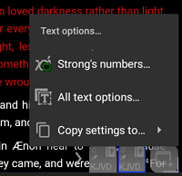

Getting Started
===============

Installation
------------

There are four main ways to install |app| on an Android phone. You can install |app|
using the Google Play Store, F-Droid, the Amazon App Store and directly from our
GitHub source code repository.

Google Play Store
-----------------

.. image:: /images/google-play-badge.png
   :width: 200
   :target: https://play.google.com/store/apps/details?id=net.bible.android.activity

Click the image above to get the app from the Google Play store.

F-Droid
-------

.. image:: /images/f-droid-badge.png
   :width: 200
   :target: https://f-droid.org/packages/net.bible.android.activity/

Click the image above to get the app from F-Droid.

Amazon App Store
----------------

.. image:: /images/amazon-badge.png
   :width: 200
   :target: http://www.amazon.com/Martin-Denham-And-Bible/dp/B004Z2KKYK

Click the image above to get the app from the Amazon App Store.

GitHub Releases
---------------

.. image:: /images/obtainium-badge.png
   :width: 200
   :target: https://obtainium.imranr.dev/

Click the image above to get Obtainium which can download (and update)
the apk from Github. Alternatively, you can download and install the
apk directly from the "Assets" sub-menu in the
`GitHub Releases <https://github.com/AndBible/and-bible/releases/latest>`_

(Note: An apk downloaded directly from Github will not automatically update)

Windows 11 setup
-----------------

** Note: Windows Subsystem for Android has been discontinued as of March 5th, 2025.

To run |app| on Windows 11:

This may be a bit technical if you are outside the US and involves
downloading the Windows Subsystem for Android (WSA),
running a command to install it, starting Windows Subsystem for Android,
enabling developer mode, downloading the apk from GitHub releases,
and installing the app with adb.

Install WSA following these instructions:
 https://www.xda-developers.com/how-to-run-android-apps-on-any-windows-11-pc/

Set up adb:
 https://www.xda-developers.com/install-adb-windows-macos-linux/

Download the APK from GitHub releases:
 https://github.com/AndBible/and-bible/releases/latest

How to sideload apps on WSA:
 https://www.xda-developers.com/how-to-sideload-android-apps-on-windows-11/

Linux setup
-----------

See instructions from our Wiki: https://github.com/AndBible/and-bible/wiki/Running-AndBible-on-Linux

Changing the look and feel
--------------------------

You can use the workspace "All Text Options" to change the look and feel of document texts. You can access these options from the kabab menu on the top right (aka three vertical dots).
Use this menu to adjust various |app| appearance options including font size and type, text and background colors, toggling words of Christ in red, and more.

When using multiple windows, you can use the individual window text options to override current workspace settings. Tap and hold the square window icon at the bottom for the window whose settings you wish to customize.  Choose "Text Options" then "All Text Options".  This will open the menu to configure |app|'s' appearance for that specific window.

For things that can not be changed through these menus, like the color of certain texts within a module, e.g. Strong's numbers, you can code the color in the style.css file located within  a zip package. You can use HiSB Bible module to see the structure and placement of this file, it should be located in the modules/texts/ztext/hisb/style directory.
Once coded you simply use the "Load From Zip" function under Backup/Restore section of the main menu.
