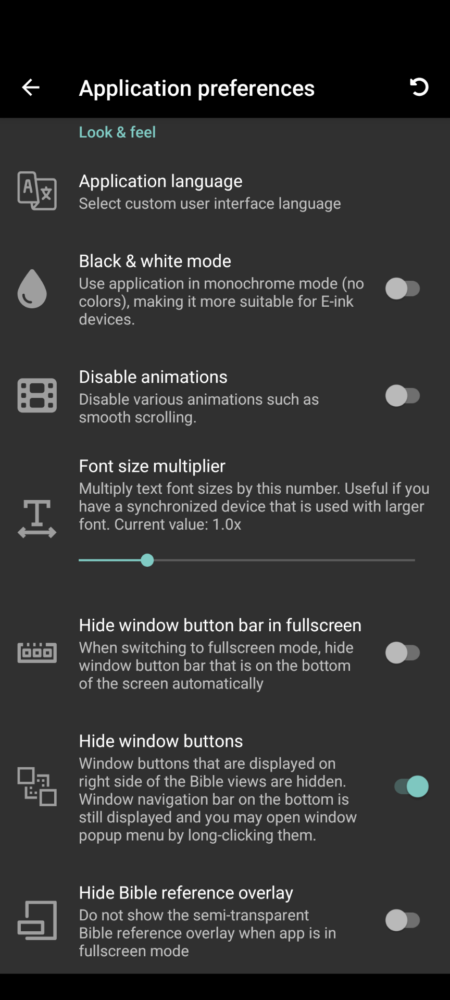
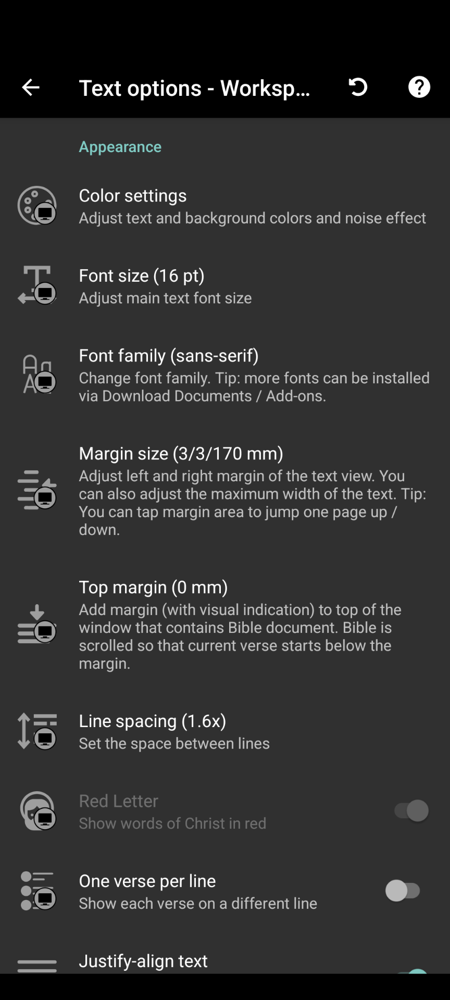
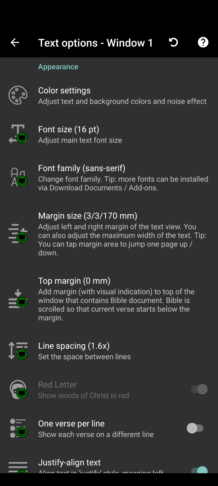

Look and Feel
=============

The look and feel of |app| can be configured for the entire application, for
specific workspaces, specific windows, or even individual modules.

Application
-----------

To configure application-wide look and feel settings, navigate to the top left
main menu (|hamburger|) and click `Application preferences`. Some options that
you can use to customize the look and feel of the application are:

    - **Application language:** Choose the language you would like the application
      to use in dialogs, settings, etc.
    - **Black & white mode:** Enabling this setting reduces the use of colors.
      This is useful for e-ink displays.
    - **Disable animations:** Enabling this setting will reduce animations that
      may not work well on e-ink or very old devices.
    - **Font size multiplier:** Changing this setting will scale document text
      sizes. It can be useful for devices with larger screens.
    - **Hide window button bar in fullscreen:** Enabling this setting will hide
      the bottom window buttons when in fullscreen mode - giving you a distraction-free
      fullscreen view.
    - **Hide window buttons:** Enabling this setting will hide the per-window menu
      buttons. Instead you can use the window button bar at the bottom of the screens
      to access window menus for each window.
    - **Hide Bible reference overlay:** Enabling this setting will hide the Bible
      reference overlay near the bottom of the screen when in fullscreen mode.
    - **Show active window indicator:** Enabling this setting will highlight window
      corners of the active window in the reading pane. This makes it easier to see
      which window is the active window.
    - **One-tap actions (Bibles/Other):** You can configure what context menu items
      are visible when selecting text in Bibles or other documents.

Workspace
---------

To configure the look and feel of individual workspaces, click on the three dot
kebab menu on the top right of your workspace. From there click on `All Text Options`.

Various appearance options can be changed:

    - Color Settings
        - Workspace color
        - Text color
        - Backgorund color & Background noise
    - Font size
    - Font family
    - Margin size
    - Top margin
    - Line spacing
    - Red Letter
    - One verse per Line
    - Justify-align text
    - Hyphenation
    - Relative page number

Window
------
When using multiple windows, you can even customize the individual window text
options to override current workspace settings. To change window text options:

    #. Tap and hold the square window icon at the bottom for the window you would
       like to customize.
    #. Click `Text Options`, then click `All Text Options`.

All of the same options that you could configure in `Workspace`_ can now be configured
for the selected window:

Module
------
For things that can not be changed through application, workspace, or window
settings, like the color of certain text within a module, e.g. Headings or
Strong's numbers, you can code the color in the style.css file located within
the module's zip package. You can use the HiSB Bible module to see the structure
and placement of this file, it should be located in the `modules/texts/ztext/hisb/style`
directory.

Once coded, you can follow the steps in :doc:`Backup and Restore</backup_restore>`
to load your customized module.
