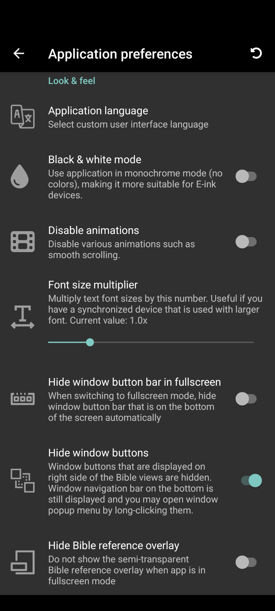
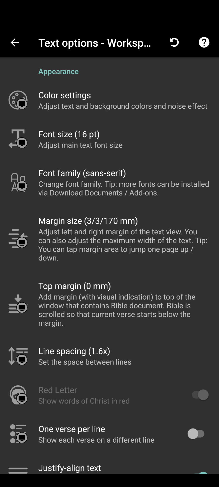
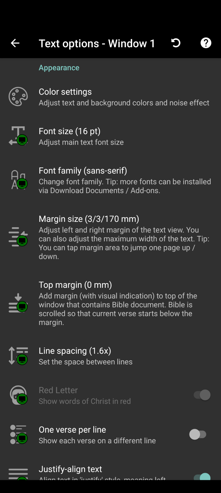

Look and Feel
=============

The look and feel of |app| can be configured for the entire application, for
specific workspaces, specific windows, or even individual modules.

Application
-----------

To configure application-wide look and feel settings (which are not synced to
other devices), navigate to the top left main menu (|hamburger|) and click
``Settings``. These settings apply to the local device only.

General
^^^^^^^

- **Application language:** Choose the language for the application interface
  (dialogs, menus, settings).
- **Night mode:** Control when the dark theme is used:

  - *Manual* (default) -- toggle dark mode from the three-dot menu.
  - *Automatic* -- switch based on time of day.
  - *System* -- follow the Android system dark mode setting (Android 10+).

- **Format for new bookmark notes:** Choose whether new :doc:`notes </notes>`
  are created with the **HTML** editor or the **Markdown** editor. Existing
  notes keep the format they were created with.

E-Ink Displays
^^^^^^^^^^^^^^

- **Black & white mode:** Reduces the use of colors throughout the application.
  Recommended for e-ink displays where color rendering is limited.
- **Disable animations:** Turns off smooth scrolling and transition animations.
  Improves responsiveness on e-ink screens and very old devices.

These two settings work well together for an optimal e-ink reading experience.

Font and Text
^^^^^^^^^^^^^

- **Font size multiplier:** A global scaling factor (10%--500%) applied to all
  document text. Useful when you synchronize workspaces across devices with
  different screen sizes -- the workspace font size is synced, but the
  multiplier is per-device. For example, setting 150% on a small phone while
  leaving 100% on a tablet keeps text proportional.

Fullscreen and Window Display
^^^^^^^^^^^^^^^^^^^^^^^^^^^^^

- **Hide window button bar in fullscreen:** Hides the bottom window buttons
  when in fullscreen mode for a distraction-free view.
- **Hide window buttons:** Hides the menu buttons at the top right of each
  window. You can still access the window menu by long-pressing the buttons in
  the bottom window bar.
- **Hide Bible reference overlay:** Hides the semi-transparent Bible reference
  indicator that normally appears near the bottom of the screen in fullscreen
  mode.
- **Show active window indicator:** Highlights the corners of the active window
  with a colored border. Makes it easier to see which window is currently
  active when using multiple windows side by side.

One-Tap Actions
^^^^^^^^^^^^^^^

When you tap on a verse or text, a quick action bar appears. You can customize
which buttons are shown in this bar:

- **One-tap actions (Bibles):** Configure which actions appear when tapping
  text in Bible documents. Available actions include: Bookmark, Bookmark with
  note, My Notes, Share, Compare, Speak, and Memorize.
- **One-tap actions (Other documents):** Configure which actions appear for
  non-Bible documents (commentaries, books, etc.). Available actions include:
  Bookmark, Bookmark with note, and Speak.

Study Pad
^^^^^^^^^

- **Disable Study Pad click-to-edit:** When enabled, notes in Study Pads can
  only be edited by tapping the edit button, not by clicking on the note text
  directly. This prevents accidental edits while reading.

Workspace
---------

To configure the look and feel of individual workspaces, click on the three dot
kebab menu on the top right of your workspace. From there click on `All Text Options`.

Various appearance options can be changed. These settings are synced across
devices.

Formatting
""""""""""

- **Section titles:** Show non-canonical section titles added by translators.
- **Title scroll button:** Show a small button next to section titles that
  scrolls to the top of the section when tapped.
- **Verse numbers:** Show or hide chapter and verse numbers.
- **Footnotes:** Show footnotes if available in the document. Optionally
  display them inline rather than in a popup.
- **Cross references:** Show cross-reference markers. Optionally expand them
  inline to see referenced text directly.
- **Strong's numbers:** Show links to Greek and Hebrew dictionary definitions.
- **Morphological codes:** Show Robinson's Greek morphology codes.
- **Italicize added words:** Italicize words that do not have Strong's numbers
  associated with them. Useful for translations like KJV where added words are
  traditionally shown in italics.
- **Infinite scroll:** Automatically load more content when you scroll to the
  end of a chapter.

Text Appearance
"""""""""""""""

- **Colors:** Adjust text color, background color, and background noise
  (a subtle texture overlay on the background).
- **Font size:** Set the base text size in points.
- **Font family:** Change the typeface. Additional fonts can be installed via
  font add-on modules.
- **Margin size:** Set the left and right margins independently, measured in
  millimeters. You can also set a maximum text width to prevent lines from
  becoming too long on wide screens.
- **Top margin:** Add a margin at the top of the window (in millimeters). The
  reading position starts below this margin.
- **Line spacing:** Adjust the space between lines (multiplier from 1.0x to
  2.0x).
- **Paragraph spacing:** Adjust the space between paragraphs (in millimeters).
- **Red letter:** Show the words of Christ in red.
- **One verse per line:** Display each verse on a separate line.
- **Justify text:** Align text to both left and right margins.
- **Hyphenation:** Automatically hyphenate words at line breaks (if supported
  by the language).
- **Relative page number:** Show a page number overlay indicating your position
  relative to where you started reading.

Window
------
When using multiple windows, you can even customize the individual window text
options to override current workspace settings. To change window text options:

    #. Tap and hold the square window icon at the bottom for the window you would
       like to customize.
    #. Click `Text Options`, then click `All Text Options`.

All of the same options that you could configure in `Workspace`_ can be overridden
for the selected window. In the screenshot below you can see that the window
`Color settings` are overriding the workspace `Color settings`. To indicate this,
there is no workspace icon on the `Color settings` icon). To reset all window
settings back to the workspace settings, you can click the circular back arrow
at the top right of the window settings screen.

Module
------
For things that can not be changed through application, workspace, or window
settings, like the color of certain text within a module, e.g. Headings or
Strong's numbers, you can code the color in the style.css file located within
the module's zip package. You can see some examples of this being implemented here:

  - https://github.com/AndBible/special-modules/tree/master/HISB/modules/texts/ztext/HISB/style
  - https://github.com/AndBible/special-modules/tree/master/StyleExample/modules/texts/ztext/StyleExample/style

For more details on how to create custom CSS modules, see :doc:`Custom CSS<customisation/custom_css>`
and placement of this file, it should be located in the `modules/texts/ztext/hisb/style`
directory.

Once the customized module is coded, you can follow the steps in
:doc:`Backup and Restore</backup_restore>` to load your customized module.
